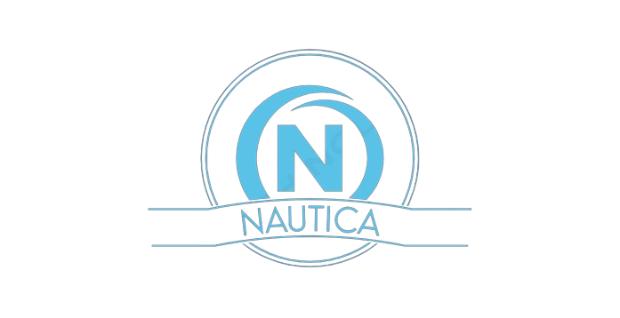

# Nautica

  

Nautica is a desktop application designed for managing nautical sports clubs. It provides comprehensive features for managing employees, clients, equipment, subscriptions, events, and more.

## Features

- **Employee Management:** Keep track of employees including their roles, schedules, and contact information.
- **Client Management:** Manage clients' profiles, memberships, and subscriptions efficiently.
- **Equipment Management:** Track inventory, maintenance schedules, and usage of equipment.
- **Subscription Management:** Handle different types of subscriptions offered by the club, including renewals and cancellations.
- **Event Management:** Organize and schedule events such as training sessions, competitions, and social gatherings.

## Usage

1. Upon launching the application, you will be greeted with a login screen.
2. Use your credentials to log in.
3. Navigate through the intuitive interface to access different modules such as Employee, Client, Equipment, Subscription, and Event management.
4. Perform various actions like adding, editing, and deleting records as needed.
5. Generate reports to gain insights into club operations.

## Technologies Used

- **Programming Language:** C++
- **GUI Framework:** Qt 5.9.9
- **Database:** Oracle

## License

This project is licensed under the [MIT License](LICENSE).
